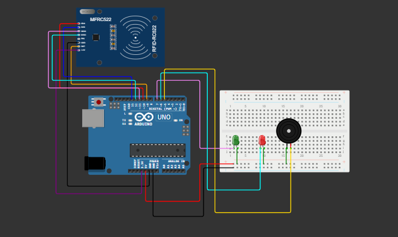

# 🏋️‍♂️ Smart Gym — Ecossistema de Estações Inteligentes · CP02

> **FIAP — Engenharia de Software · Physical Computing (IoT & IoB)**  
> Checkpoint 02 — Persistência de Dados & Interface Homem-Máquina (IHM)

---

## 👥 Equipe

| Nome | RM |
|------|----|
| Carlos Eduardo | 556785 |
| Gabriel Danius | 555747 |
| Caio Rossini | 555084 |
| Giulia Rocha | 558084 |

---

## 📌 Descrição do Projeto

O projeto evolui o protótipo do CP01 (leitura RFID + visão computacional) adicionando:

- **Banco de Dados SQLite** para persistência do cadastro de alunos e log de sessões.
- **Interface Gráfica (Tkinter)** com painel de boas-vindas, contador de repetições em tempo real e status da estação.
- **Integração completa** do fluxo: cartão RFID → consulta no banco → câmera ativa com esqueleto MediaPipe → registro automático do acesso no banco.

---

## 🗂️ Estrutura do Repositório

```
Physical-Computing/
├── arduino_rfid/
│   └── smart_gym_rfid.ino      # Firmware Arduino (RFID RC522 + LED + Buzzer)
├── python_vision/
│   ├── setup_db.py             # Cria banco e insere alunos de exemplo
│   ├── main.py                 # Sistema principal (Tkinter + MediaPipe + SQLite)
│   └── smart_gym.db            # Banco SQLite gerado após rodar setup_db.py
├── docs/
│   └── wokwi_diagram.png       # Screenshot do circuito no Wokwi
└── README.md
```

---

## 🗃️ Banco de Dados — Descrição das Tabelas

### `alunos`

| Coluna | Tipo | Descrição |
|--------|------|-----------|
| `id` | INTEGER PK | Identificador único |
| `nome` | TEXT | Nome completo do aluno |
| `uid_cartao` | TEXT UNIQUE | UID hexadecimal do cartão RFID |
| `exercicio` | TEXT | Exercício prescrito para a estação |
| `repeticoes` | INTEGER | Meta de repetições por série |

### `sessoes` (Log de Acesso)

| Coluna | Tipo | Descrição |
|--------|------|-----------|
| `id` | INTEGER PK | Identificador único da sessão |
| `aluno_id` | INTEGER FK | Referência ao aluno |
| `uid_cartao` | TEXT | UID utilizado no acesso |
| `entrada` | TEXT | Data/hora de entrada (ISO-8601) |
| `saida` | TEXT | Data/hora de saída (preenchido ao encerrar) |
| `rep_realizadas` | INTEGER | Total de repetições contadas no treino |

---

## 🔩 Hardware e Componentes

| Componente | Qtd |
|------------|-----|
| Arduino Uno | 1 |
| Módulo RFID RC522 | 1 |
| Cartão/Tag RFID 13.56 MHz | 2+ |
| LED Verde (5 mm) | 1 |
| LED Vermelho (5 mm) | 1 |
| Buzzer Ativo 5V | 1 |
| Resistores 220Ω | 2 |
| Jumpers macho-fêmea | 10 |
| Webcam USB (ou integrada) | 1 |

---

## 📚 Bibliotecas Utilizadas

### Arduino / C++

| Biblioteca | Função |
|------------|--------|
| `SPI.h` | Comunicação síncrona com o RC522 |
| `MFRC522.h` | Abstração do leitor RFID |

### Python

| Biblioteca | Função |
|------------|--------|
| `pyserial` | Comunicação serial Arduino ↔ PC |
| `opencv-python (cv2)` | Captura e processamento de vídeo |
| `mediapipe` | Pose Estimation (esqueleto corporal) |
| `Pillow (PIL)` | Renderização de frames no canvas Tkinter |
| `sqlite3` | Banco de dados (nativo Python) |
| `tkinter` | Interface gráfica (nativo Python) |

---

## 🔌 Diagrama de Conexões (Wokwi)

[Link do projeto no Wokwi:](https://wokwi.com/projects/461231531669227521)

### Pinagem RFID RC522 → Arduino Uno

| RC522 | Arduino |
|-------|---------|
| SDA (SS) | D10 |
| SCK | D13 |
| MOSI | D11 |
| MISO | D12 |
| RST | D9 |
| GND | GND |
| 3.3V | 3.3V |

### LEDs e Buzzer

| Componente | Arduino | Resistor |
|------------|---------|----------|
| LED Verde (anodo) | D7 | 220Ω → GND |
| LED Vermelho (anodo) | D6 | 220Ω → GND |
| Buzzer (+) | D5 | — |
| Buzzer (−) | GND | — |



---

## ⚙️ Instruções de Setup e Execução

### 1. Arduino

1. Instale a **IDE Arduino** (ou use o Arduino Web Editor).
2. Em **Gerenciador de Bibliotecas**, instale: **MFRC522** (by GithubCommunity).
3. Abra `arduino_rfid/smart_gym_rfid.ino` e faça o upload para o Arduino Uno.
4. Verifique a porta serial gerada (ex.: `COM3` no Windows, `/dev/ttyACM0` no Linux).

### 2. Python — Ambiente

```bash
# Clone o repositório
git clone https://github.com/carloseduardorf/Physical-Computing.git
cd Physical-Computing/python_vision

# Instale dependências
pip install pyserial opencv-python mediapipe pillow
```

### 3. Banco de Dados — Primeira execução

```bash
python setup_db.py
```

> Isso cria o arquivo `smart_gym.db` e insere 4 alunos de exemplo.  
> **Importante:** edite o arquivo e substitua os UIDs pelos valores reais dos seus cartões antes de rodar.

### 4. Descobrir o UID do seu cartão

Abra o **Monitor Serial** na IDE Arduino (9600 baud) e aproxime o cartão — o UID será impresso na tela.

### 5. Executar o sistema principal

```bash
# Ajuste SERIAL_PORT em main.py (linha 25) conforme sua porta
python main.py
```

> **Sem hardware?** Pressione **F5** para simular uma leitura de cartão cadastrado, ou **F6** para simular UID inválido.

---

## 🎬 Fluxo Completo do Sistema

```
Aluno aproxima o cartão
        ↓
Arduino lê o UID e envia via Serial
        ↓
Python recebe o UID → consulta SQLite (tabela alunos)
        ↓
[Encontrado] ─→ Tkinter exibe boas-vindas + exercício
              → Arduino recebe "OK" → LED verde + beep
              → Câmera ativa → MediaPipe detecta esqueleto
              → Contador de repetições em tempo real
              → Ao encerrar: registra saída + reps no SQLite (tabela sessoes)
        ↓
[Não encontrado] → Arduino recebe "DENY" → LED vermelho + beep longo
                 → Tkinter exibe "UID não cadastrado"
```

---

## 🎥 Vídeo Demonstrativo

> **[▶ Assistir ao vídeo demonstrativo](https://drive.google.com/file/d/1cw_Tlrpd-OFaRGaFQTgoe8G0EGRkGjqQ/view?usp=sharing)**  


---

## 📄 Licença

Projeto acadêmico — FIAP 2026. Todos os direitos reservados.
